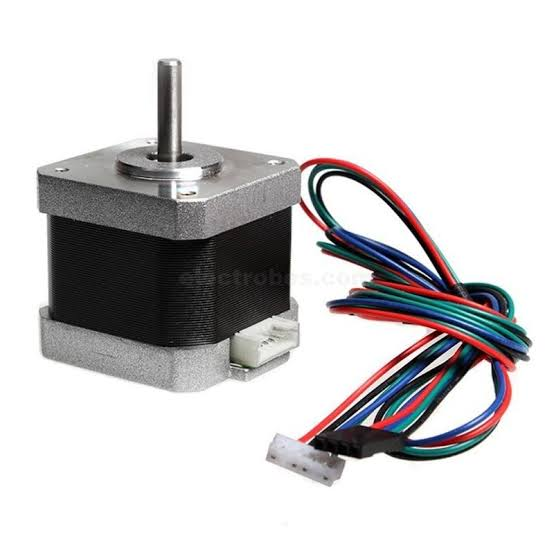
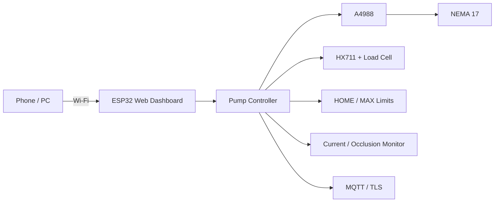

# P-TECH ESP32 NEMA 17 Web Controller & SmartSyringe Engineering Platform

ESP32-based stepper-motor control platform built around an **A4988 driver** and **NEMA 17 motor**, extended with the P-TECH SmartSyringe engineering/bench-testing software.

> **Important:** SmartSyringe is an engineering/bench-testing project. It is **not for use on patients** and does not establish clinical performance, regulatory compliance, or certification.

## Repository

- ESP32 NEMA 17 controller
- A4988 STEP/DIR/ENABLE motor control
- Web-based local control
- SmartSyringe progressive motion firmware
- HX711 load-cell integration
- HOME/MAX limit monitoring
- Motor-current/occlusion monitoring
- MQTT/TLS telemetry and commands
- Engineering validation and analysis dashboard

## Hardware

| Component | Purpose |
|---|---|
| ESP32 DevKit | Main controller and web server |
| A4988 | NEMA 17 stepper driver |
| NEMA 17 | Linear/rotary actuator |
| HX711 + load cell | Gravimetric measurement |
| HOME limit switch | Homing reference |
| MAX limit switch | Travel protection |
| Motor-current sensor | Current/occlusion monitoring |
| External motor supply | A4988 motor power |

## Original NEMA 17 Controller



The original controller uses GPIO 25 for STEP, GPIO 26 for DIR and GPIO 27 for ENABLE.

## SmartSyringe Engineering Build

The current engineering design uses a calibrated 60 mL syringe travel of 12,463 steps (about 207.7167 steps/mL), with acceleration/deceleration, homing, MAX protection, HX711 measurement, current monitoring, MQTT, and a browser dashboard. The firmware source also explicitly requires homing and enforces a maximum configured flow rate. These are engineering controls, not clinical validation.

### SmartSyringe folder

```text
SmartSyringe/
├── syringe_pump_v3.ino
├── PTECH_Smart_Syringe_Pump_v8_Engineering_Dashboard_GRAPH.inc
├── dashboard_html.h
├── PumpTypes.h
├── Secrets.example.h
└── .gitignore
```

### Credentials

**No real Wi-Fi, MQTT, dashboard passwords, API keys, or private certificates belong in this repository.**

Create a local `Secrets.h` from `SmartSyringe/Secrets.example.h` and fill in your own values. `Secrets.h`, `.env` files and other secret patterns are excluded by `.gitignore`.

If a credential that was previously exposed has been used in a real deployment, rotate/revoke it at the provider before using the cleaned repository.

## SmartSyringe Safety Notice

This repository is for **educational, engineering and controlled bench testing**. Do not connect it to a patient or use it for medication delivery. Validation features such as gravimetric accuracy, repeatability, occlusion response, limit checks and network recovery are engineering tests and are not a substitute for medical-device verification/validation.

## Arduino Libraries

The engineering firmware uses:

```cpp
WiFi
WiFiClientSecure
PubSubClient
AccelStepper
HX711
ArduinoJson
WebServer
```

Install the corresponding ESP32 board support and libraries in Arduino IDE before compiling.

## Original Controller API

The original local motor controller exposes endpoints such as:

```text
/
/move
/stop
/reset
/status
```

Do not copy credentials from old screenshots or documentation into a public deployment. Configure authentication and network access for your own environment.

## Images

Project images are kept under `images/` so README previews remain organized with the source. Existing repository images are retained rather than publishing unrelated personal/project photos.

## Project Architecture



## Calibration / Engineering Data

The current engineering source documents:

- 60 mL maximum syringe volume
- 12,463 calibrated steps for the full travel
- 1.25 mm lead-screw pitch
- 200 motor steps/revolution
- 16 microsteps
- GPIO 25 STEP
- GPIO 26 DIR
- GPIO 27 ENABLE
- GPIO 32 HOME
- GPIO 33 MAX
- GPIO 16 HX711 DOUT
- GPIO 17 HX711 SCK
- GPIO 34 motor-current ADC

Treat these as project configuration values that must be verified against the physical build before any bench test.

## Author

**P-TECH — Precision Technology, Engineering & Creative Hardware**

GitHub: `ptech8000`

## License

See [`LICENSE`](LICENSE).
