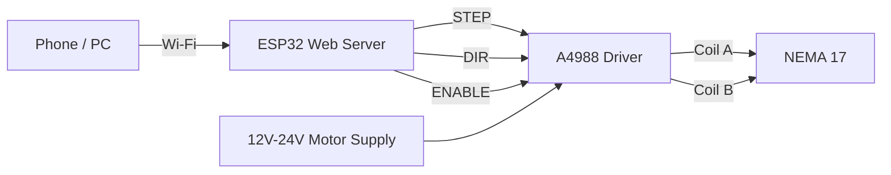

# ESP32 NEMA 17 Web Motor Controller

> A Wi-Fi-enabled stepper motor controller built with an **ESP32 DevKit**, **A4988 stepper driver**, and **NEMA 17 stepper motor**. Control the motor from any phone, tablet, or computer connected to the ESP32's Wi-Fi access point through a simple web interface.

##  Features

*  Built-in ESP32 Wi-Fi Access Point
*  Browser-based motor control interface
*  Configurable number of steps
*  Adjustable step speed
*  Forward and reverse movement
*  Emergency motor stop
*  Software position tracking
*  Position reset
*  A4988 STEP/DIR/ENABLE control
*  Works from phones, tablets, and computers
*  No Internet connection required
*  Simple and expandable architecture

---

##  Project Preview

### Motor Controller


### Web Interface


---

##  Project Architecture



### Control Flow

```text
User
 │
 │ Wi-Fi
 ▼
ESP32 Web Interface
 │
 ├── Steps
 ├── Speed
 ├── Direction
 ├── Stop
 └── Position Reset
 │
 ▼
ESP32 Motor Controller
 │
 ├── STEP
 ├── DIR
 └── ENABLE
 │
 ▼
A4988 Stepper Driver
 │
 ▼
NEMA 17 Stepper Motor
```

---

#  Hardware

| Component                      |    Quantity | Purpose                      |
| ------------------------------ | ----------: | ---------------------------- |
| ESP32 DevKit                   |           1 | Main controller & web server |
| A4988                          |           1 | Stepper motor driver         |
| NEMA 17                        |           1 | Stepper motor                |
| 12–24 V DC Power Supply        |           1 | Motor power                  |
| Electrolytic capacitor ≥100 µF |           1 | VMOT filtering               |
| Breadboard                     |           1 | Prototyping                  |
| Jumper wires                   | As required | Connections                  |

### Recommended Motor Supply

The A4988 motor supply should be within its supported motor-voltage range. For this project, a **12 V supply** is a practical starting point.

**Do not power the NEMA 17 directly from the ESP32.**

---

# 🔌 Wiring

## ESP32 → A4988

| ESP32 GPIO | A4988  | Function      |
| ---------: | ------ | ------------- |
|    GPIO 25 | STEP   | Step pulse    |
|    GPIO 26 | DIR    | Direction     |
|    GPIO 27 | ENABLE | Driver enable |
|      3.3 V | VDD    | Logic supply  |
|        GND | GND    | Common ground |

## A4988 → NEMA 17

The motor has four wires representing two independent coils.

For the motor used during development:

| Motor wire | A4988 |
| ---------- | ----- |
| Red        | 1A    |
| Blue       | 1B    |
| Green      | 2A    |
| Black      | 2B    |

**Important:** Wire colors are not universal. If using another NEMA 17, identify the two coil pairs with a multimeter before connecting it.

### Motor Power

```text
External PSU (+)
       │
       ▼
     VMOT
     A4988
     GND
       ▲
       │
External PSU (-)
```

Connect a **100 µF or larger electrolytic capacitor** close to the A4988 between `VMOT` and `GND`.

---

#  A4988 Configuration

For the initial setup, the driver can be operated in **full-step mode**.

```text
MS1 = LOW
MS2 = LOW
MS3 = LOW
```

A typical 1.8° NEMA 17 has:

```text
200 full steps / revolution
```

Therefore:

| Steps | Approx. movement |
| ----: | ---------------: |
|    50 |              90° |
|   100 |             180° |
|   200 |             360° |
|   400 |    2 revolutions |
|  1000 |    5 revolutions |

Actual positioning depends on the motor, microstepping configuration, and mechanical system.

---

#  Web Interface

After powering the ESP32, connect your phone or computer to:

```text
Wi-Fi SSID:
NEMA17_MOTOR
```

Default password:

```text
12345678
```

Then open:

```text
http://192.168.4.1
```

The interface provides:

```text
┌──────────────────────────────┐
│       P-TECH                 │
│   NEMA 17 MOTOR CONTROL      │
├──────────────────────────────┤
│                              │
│ Steps: [ 200             ]   │
│                              │
│ Speed: [ 500 steps/sec   ]   │
│                              │
│ [ ◀ REVERSE ] [ FORWARD ▶ ]  │
│                              │
│          [ STOP ]             │
│                              │
│ Position: 200 steps          │
│ Motor: Stopped               │
│                              │
│     [ RESET POSITION ]       │
└──────────────────────────────┘
```

---

#  Motor Controls

### Forward

Moves the motor in the forward direction by the number of steps specified.

Example:

```text
Steps = 200
```

The motor performs approximately:

```text
1 revolution
```

with a standard 1.8° motor in full-step mode.

### Reverse

Moves the specified number of steps in the opposite direction.

### Speed

Controls the approximate stepping frequency.

Example:

```text
500 steps/sec
```

### Stop

Immediately stops issuing additional step pulses.

### Reset Position

Sets the software position counter back to:

```text
0
```

> The position is software-based and is not an absolute physical position. For true absolute positioning, add a limit switch, homing sensor, encoder, or other position reference.

---

#  API Endpoints

The ESP32 exposes simple HTTP endpoints.

| Endpoint  | Method | Description             |
| --------- | ------ | ----------------------- |
| `/`       | GET    | Web control interface   |
| `/move`   | GET    | Move motor              |
| `/stop`   | GET    | Stop motor              |
| `/reset`  | GET    | Reset software position |
| `/status` | GET    | Return motor status     |

## Move Motor

Example:

```text
/move?steps=200&direction=forward&speed=500
```

Parameters:

| Parameter   | Example   | Description            |
| ----------- | --------- | ---------------------- |
| `steps`     | `200`     | Number of steps        |
| `direction` | `forward` | `forward` or `reverse` |
| `speed`     | `500`     | Steps per second       |

Example reverse command:

```text
/move?steps=400&direction=reverse&speed=300
```

---

## Status API

Request:

```text
/status
```

Example response:

```json
{
  "position": 200,
  "running": false
}
```

This makes the project easy to integrate with:

* Mobile applications
* PWAs
* JavaScript interfaces
* Home automation systems
* Robotics control systems
* REST-based automation systems

---

#  Software Requirements

### Arduino IDE

Recommended:

```text
Arduino IDE 1.8.x or newer
```

### ESP32 Board Package

Install the ESP32 board support through the Arduino IDE Board Manager.

Select:

```text
Board:
ESP32 Dev Module
```

### Required Libraries

The project uses the standard ESP32 libraries:

```cpp
#include <WiFi.h>
#include <WebServer.h>
```

No external web-server library is required.

---

#  Installation

### 1. Clone the repository

```bash
git clone https://github.com/ptech8000/ESP32_NEMA17_Web_Controller.git
```

### 2. Open the project

Open:

```text
ESP32_NEMA17_Web_Controller.ino
```

in Arduino IDE.

### 3. Select your ESP32

Go to:

```text
Tools → Board → ESP32 Arduino → ESP32 Dev Module
```

### 4. Select the correct COM port

```text
Tools → Port → COMx
```

### 5. Upload

Click:

```text
Upload
```

### 6. Open Serial Monitor

Set:

```text
Baud Rate: 115200
```

You should see something similar to:

```text
================================
P-TECH NEMA 17 CONTROLLER
================================

WiFi SSID: NEMA17_MOTOR
Password: 12345678

Open: http://192.168.4.1

Web server started.
```

---

#  Safety & Hardware Notes

### Never disconnect the motor while the A4988 is powered

Disconnecting the motor while the driver is energized can damage the A4988.

### Set the current limit correctly

The A4988 current limit must be adjusted according to the NEMA 17 motor's rated current and the particular A4988 module.

An incorrect setting can cause:

* Motor overheating
* Driver overheating
* Missed steps
* Poor torque
* Driver failure

### Use a separate motor power supply

Do not attempt to power the NEMA 17 from:

```text
ESP32 3.3 V
```

or:

```text
ESP32 5 V
```

### Common ground

The ESP32 and A4988 logic ground must share a common ground.

---

#  Project Structure

```text
ESP32_NEMA17_Web_Controller/
│
├── ESP32_NEMA17_Web_Controller.ino
│
├── images/
│   ├── project.jpg
│   ├── web-interface.png
│   └── wiring.png
│
├── README.md
│
├── LICENSE
│
└── .gitignore
```


#  Possible Applications

This controller can serve as the foundation for:

*  Robotics
*  Linear actuators
*  Camera sliders
*  Pan/tilt mechanisms
*  Automation systems
*  Automated dispensing systems
*  Laboratory equipment
*  CNC mechanisms
*  Motorized camera systems
*  Agricultural automation
*  Circuit Diagonstics

---

#  Technical Specifications

| Parameter             | Value             |
| --------------------- | ----------------- |
| Controller            | ESP32 DevKit      |
| Driver                | A4988             |
| Motor                 | NEMA 17           |
| Control               | STEP / DIR        |
| STEP GPIO             | GPIO 25           |
| DIR GPIO              | GPIO 26           |
| ENABLE GPIO           | GPIO 27           |
| Wi-Fi                 | ESP32 SoftAP      |
| Default SSID          | `NEMA17_MOTOR`    |
| Web server            | ESP32 `WebServer` |
| Default IP            | `192.168.4.1`     |
| Default speed         | 500 steps/sec     |
| Default test movement | 200 steps         |
| Position tracking     | Software-based    |

---


# 👨‍💻 Author

**P-TECH**

Precision Technology, Engineering & Creative Hardware

📧 `ptech8000@gmail.com`
📞 `09069001906`

GitHub: **[@ptech8000](https://github.com/ptech8000)**

---

##  Support the Project

If this project is useful to you:

*  Star the repository
*  Fork the project
*  Report issues
*  Suggest improvements
*  Build your own version

---

### Repository tagline

> **A simple, wireless, browser-controlled NEMA 17 stepper motor platform powered by ESP32 and A4988.**
