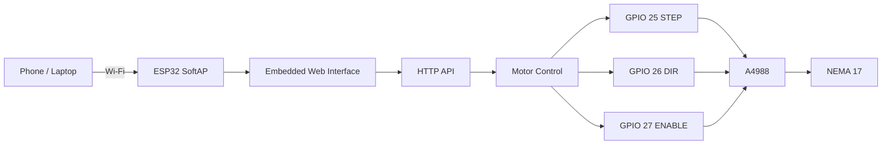

# P-TECH ESP32 NEMA 17 Web Controller

A lightweight **ESP32-based web controller for a NEMA 17 stepper motor using an A4988 driver**. The ESP32 creates its own Wi-Fi access point and hosts the control interface directly, so the controller does not require an external router, cloud service, or internet connection.


> **Engineering note:** The current `main` branch contains the standalone NEMA 17 controller firmware documented below. It is intended for educational, prototyping, and controlled engineering use.

## Features

- ESP32 SoftAP / access-point operation
- Browser-based motor control
- Forward and reverse movement
- Configurable movement distance in steps
- Configurable speed from **1–5000 steps/second**
- Real-time software position display
- Start/stop control
- Software position reset
- A4988 STEP/DIR/ENABLE control
- HTTP API for external control
- Mobile- and desktop-friendly interface
- No third-party motor-control library required

## How It Works

The ESP32 runs a `WebServer` on port 80 and embeds the HTML/CSS/JavaScript interface directly in the `.ino` file.

The main loop performs two operations:

```cpp
server.handleClient();
runMotor();
```

When a movement is requested, the browser sends:

```text
GET /move?steps=<number>&direction=<forward|reverse>&speed=<1-5000>
```

The firmware validates the step count, sets the direction, limits the speed, enables the A4988, and generates STEP pulses until the requested number of steps has been completed.

The browser polls `/status` every **300 ms** to update the displayed position and motor state.

## System Architecture



## Hardware

| Component | Purpose |
|---|---|
| ESP32 DevKit | Wi-Fi controller and web server |
| A4988 | Stepper-motor driver |
| NEMA 17 | Stepper motor / actuator |
| External motor supply | Powers the A4988 motor output stage |
| USB / 5 V supply | Powers the ESP32 |

### ESP32 → A4988

| ESP32 GPIO | A4988 Signal | Function |
|---:|---|---|
| **GPIO 25** | STEP | Step pulse output |
| **GPIO 26** | DIR | Direction control |
| **GPIO 27** | ENABLE | Driver enable/disable |

ENABLE is active-low in the firmware:

- `LOW` → A4988 enabled
- `HIGH` → A4988 disabled

The firmware does not control the A4988 MS1/MS2/MS3 microstepping pins. Microstepping therefore depends on the physical driver-module configuration.

## Wi-Fi Configuration

The current source contains:

| Setting | Value |
|---|---|
| SSID | `P-TECH_MOTOR` |
| Password | `12345678` |
| Mode | ESP32 SoftAP |
| Port | `80` |
| Protocol | HTTP |

At startup, the firmware prints the actual SoftAP IP address to the Serial Monitor.

### Basic Use

1. Upload `ESP32_NEMA17_Web_Controller.ino` to the ESP32.
2. Open the Serial Monitor at **115200 baud**.
3. Connect your phone/laptop to **`P-TECH_MOTOR`**.
4. Open the SoftAP IP address shown in the Serial Monitor.
5. Enter the required number of steps and speed.
6. Select **FORWARD** or **REVERSE**.
7. Use **STOP** to stop an active movement.
8. Use **RESET POSITION** to reset the software position counter.

> **Security:** The Wi-Fi password is currently stored in the source code. Change it before using the controller where unauthorized access is possible.

## Web Interface

The built-in page contains:

### Movement Controls

- **Steps** — requested number of step pulses.
- **Speed** — requested step rate in steps/second.
- **FORWARD** — sets `DIR_PIN` HIGH.
- **REVERSE** — sets `DIR_PIN` LOW.
- **STOP** — stops motion and disables the driver.
- **RESET POSITION** — sets the software position to zero without physically moving the motor.

### Status

The page displays:

- Current software position in steps
- `Running` / `Stopped` motor state

## HTTP API

### `GET /`

Returns the embedded web interface.

### `GET /move`

Starts a movement.

Example:

```text
/move?steps=200&direction=forward&speed=500
```

| Parameter | Required | Description |
|---|---|---|
| `steps` | Yes | Positive number of steps |
| `direction` | No | `forward` or reverse |
| `speed` | No | 1–5000 steps/s |

Response:

```text
Motor started
```

### `GET /stop`

Stops the current movement, clears the remaining step count, and disables the A4988.

Response:

```text
Motor stopped
```

### `GET /reset`

Sets the software position counter to zero. It does **not** move the motor.

Response:

```text
Position reset
```

### `GET /status`

Returns the current software position and motor state.

Example:

```json
{
  "position": 200,
  "running": false
}
```

## Position Tracking

The firmware uses:

```cpp
long currentPosition = 0;
```

Every generated step changes the counter:

```text
Forward → currentPosition++
Reverse → currentPosition--
```

This is **software position tracking only**. The current firmware has no encoder, HOME switch, MAX switch, or other absolute-position sensor. Therefore, the displayed position is not an independently verified physical position.

`RESET POSITION` only changes the counter to zero; it does not mechanically home the actuator.

## Speed Control

The selected speed is directly expressed in steps/second.

The firmware calculates the STEP interval using:

```cpp
unsigned long interval = 1000000UL / stepSpeed;
```

Current limits:

```text
Minimum: 1 step/s
Maximum: 5000 steps/s
Default: 500 steps/s
```

The controller currently uses direct constant-speed stepping. **There is no acceleration/deceleration profile in the current root firmware.**

## Motor Stop Behaviour

When `/stop` is called:

```text
motorRunning = false
remainingSteps = 0
ENABLE = HIGH
```

When the requested number of steps reaches zero, the firmware also disables the A4988 automatically.

## Current Project Structure

```text
ESP32_NEMA17_Web_Controller/
├── ESP32_NEMA17_Web_Controller.ino   # Main firmware + embedded web UI
├── A4988_Driver.jpg                  # A4988 reference image
├── images/
│   └── nema17_motor_controller.jpg   # README project image
├── LICENSE
└── README.md
```

The web application is currently embedded in `ESP32_NEMA17_Web_Controller.ino`; there is no separate HTML/CSS/JavaScript application directory in the current repository.

## Software Requirements

The firmware uses the ESP32 Arduino framework and:

```cpp
#include <WiFi.h>
#include <WebServer.h>
```

These are supplied by the ESP32 Arduino board package. No external stepper or web-server library is required by the current firmware.

Use Arduino IDE with an ESP32 board selected, upload the `.ino` file, and use **115200 baud** for the Serial Monitor.

## Engineering Considerations

### No physical end-stop protection

The current firmware does not implement HOME or MAX limit switches. Movement is controlled by the requested step count.

### No acceleration profile

The current implementation does not use `AccelStepper` or another motion-profile library. High speeds, abrupt starts/stops, mechanical load, current settings, and power supply conditions can affect whether the motor maintains commanded steps.

### Software position is not absolute

`currentPosition` is a software counter, not encoder feedback.

### A4988 current limit

Set the A4988 current limit appropriately for the particular NEMA 17 motor and driver module. Incorrect settings can cause overheating, insufficient torque, or hardware damage.

### Motor power

Use an appropriate motor supply for the A4988/NEMA 17 combination and provide the required common ground between the ESP32 control electronics and driver logic.

## Future Expansion

The existing STEP/DIR/ENABLE and HTTP architecture can serve as the foundation for future actuator-control features such as:

- Acceleration/deceleration
- Physical homing and travel limits
- Calibration-based position control
- Flow-rate control
- Load-cell feedback
- Motor-current monitoring
- Data logging
- Interactive graphs and analysis
- Authentication
- MQTT/TLS telemetry
- Progressive actuator-control workflows

These are **future capabilities and are not claimed as implemented in the current root firmware unless present in the source code**.

## Author

**P-TECH — Precision Technology, Engineering & Creative Hardware**

GitHub: `ptech8000`

## License

See [`LICENSE`](LICENSE).
